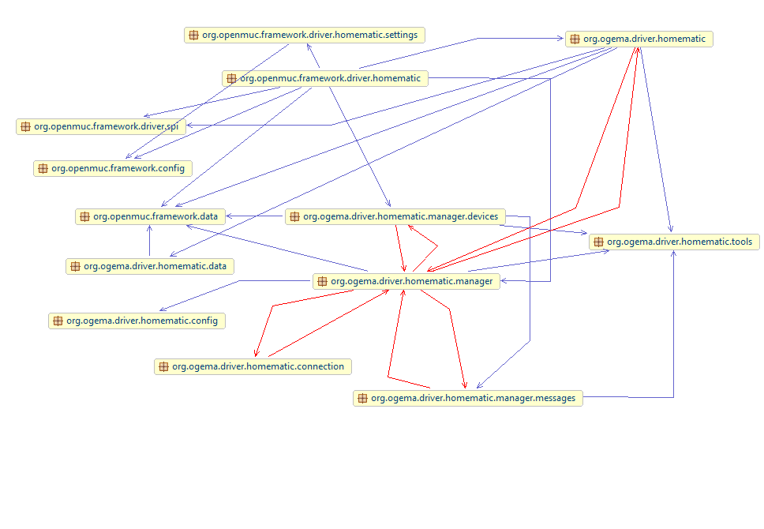
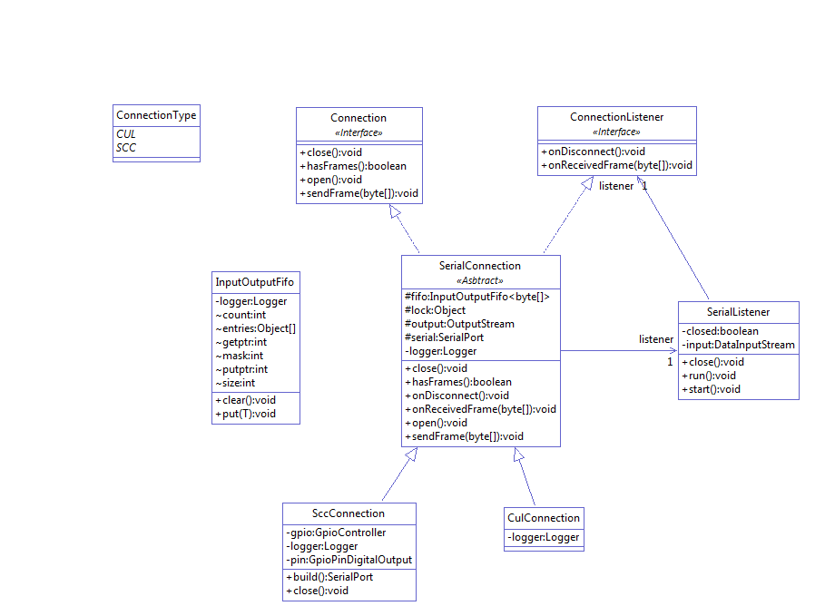
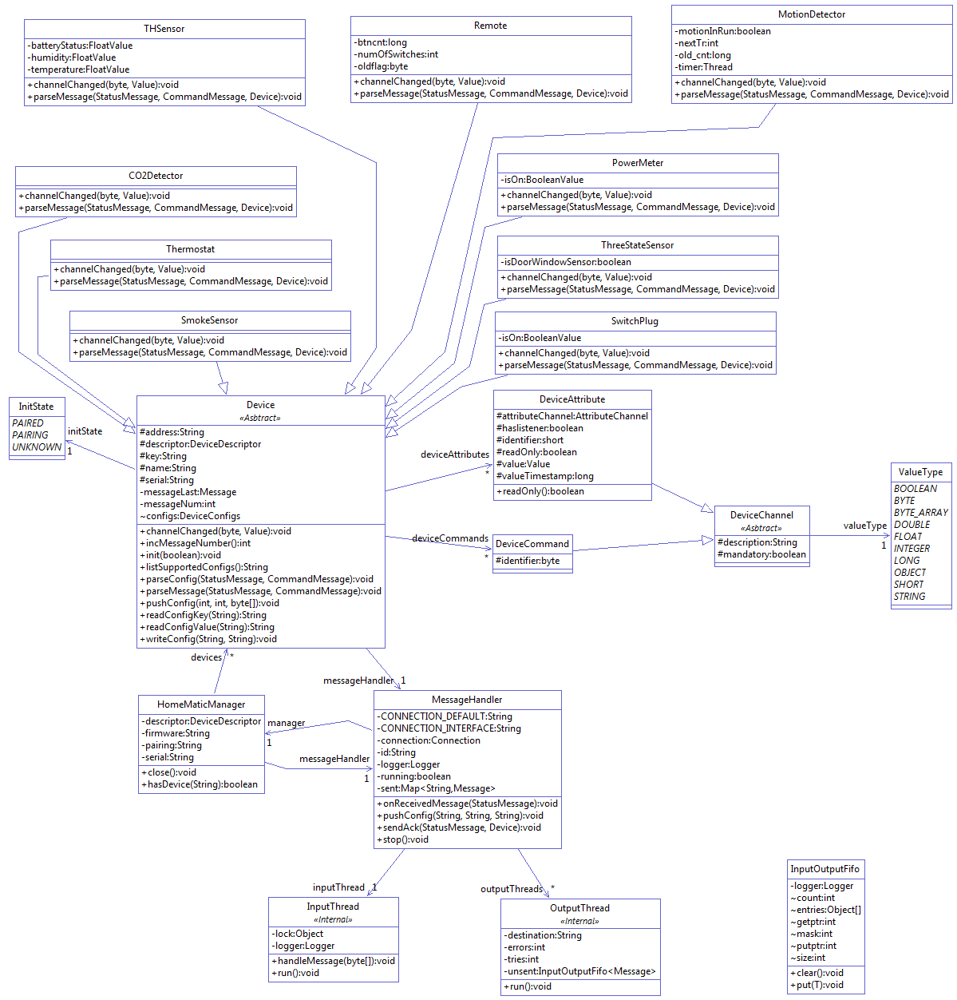
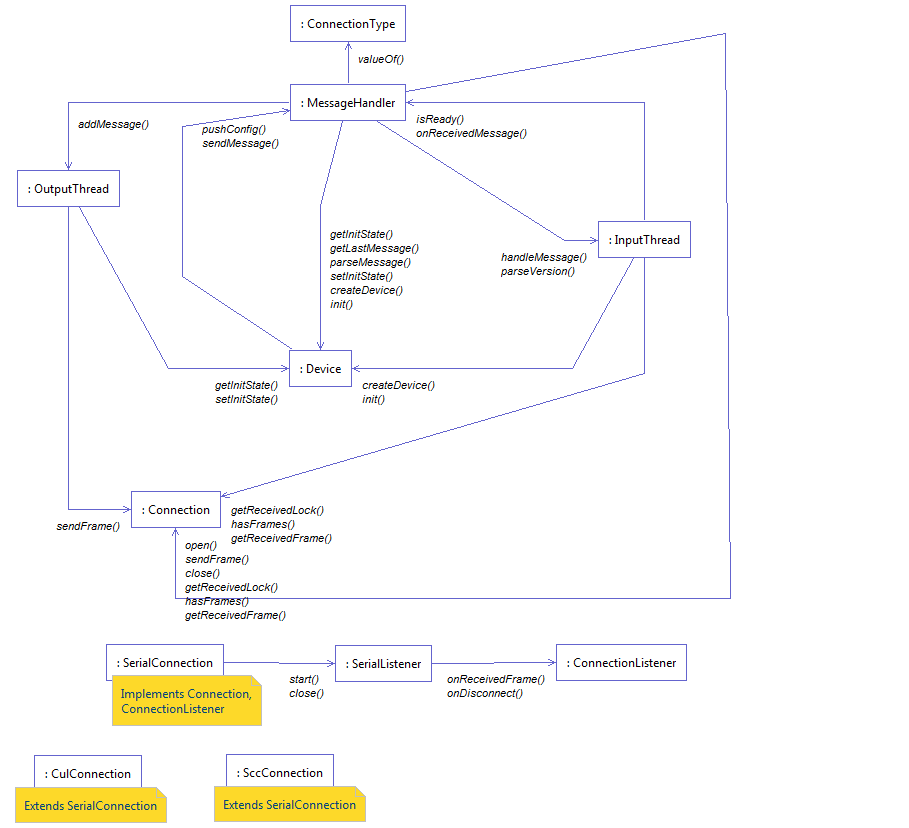

# 1 Resources

# 1.1 options.xml

The options for the device configuration for OpenMUC are defined in the options.xml. You have to identify each device by a unique address. The "Identifier" is of type String, can have an arbitrary length and has no default value. This parameter is mandatory. For each device you also have to set the type of the device. You can select the "Type" from a selection box containing all types of devices which are supported by this driver. The device type is normally somewhere printed on the hardware device. This parameter is mandatory and of type String. The String decodes the device type in hex code. Therefore it is not recommended to edit directly. Some device types has the possibility to have default values so it can be switched to the same state as they are before for example a reboot. The parameter "Default State" is of type boolean, is not mandatory and has no default value.

Each device can have one or more channels. For each channel it is mandatory to set an "Identifier". The "Identifier" is of type String, can have an arbitrary length and has no default value. For each channel you have to define the type of the channel. The channel can be of type "ATTRIBUTE" or of type "COMMAND". From attribute channels values can be read. To command channels values can be written. You can select it from a selection box. The parameter is of type String, is mandatory and the default value is "ATTRIBUTE".

In the scanForDevices method of the homematic driver it is possible to decide whether already configured and paired devices should be ignored. If disabled, all already paired and registered devices will be returned as well. The name of the parameter is "Ignore Existing". The parameter is of type Boolean, is not mandatory and has the default value "true".

# 1.2 deviceTypes.json

This configuration is a json file and interpreted by the devices class DeviceDescriptor. The first part of the json file is an array of keys, described by a hex code. For each key of a device the descriptor allows to fetch the properties name, type and channels. We build a key value pair containing the name for each key in the device configuration (see above). This key value pairs are members of the selection box. We use the device key only internally and the name of the device in the user interface.

The property type of the device type we use to create the device class of package devices. For example the device type can be "powerMeter" then we create a PowerMeter device.

The property channels are only used in the RemoteDevice class of package devices. It adds the two attributes short pressed button and long pressed button, if in the channels "Sw" or "Btn" is configured.

All other properties as "cyc", "lst" or "rxt" are not used in this driver.

# 2 Architecture

## 2.1 Introduction

The project OpenHomeMatic implements the homematic driver for [OpenMUC](https://www.openmuc.org/). It is based on the [OGEMA project](http://www.ogema.org/). The most benefit we get from the OMEGA project, is that OGEMA contains a configuration and the messages for the devices, which are exchanged between the devices and the driver. Nevertheless we decide to refactor the OGEMA sources for our purpose, because we use the OpenMUC framework with the openmuc-core-api.jar and the openmuc-core-spi.jar, which are quite different to the OGEMA api part. 
In case we use refactored OGEMA sources you will find them in the same packages as in the OGEMA project. In general the structure is the same. 
The picture below shows the structure of the projects. The red polygon belongs to OpenMUC project. To the green colored open-driver-homematic-cc1101 project belongs the packages homematic and homematic.settings. The yellow colored project homematic-cc1101 contains the package homematic, data, tools, config, manager with the sub packages devices and messages and connection. The blue lines shows the dependencies between the packages.

## 2.2 Package homematic in project open-driver-homematic-cc1101

The package homematic is base of the driver. It instantiate the homematic manger which starts the Message Handler to connect the driver over jrxtx to the devices. It connects the driver with the OpenMUC framework. The OpenMUC framework calls the connect method of the homematic driver class to connect devices by its configuration. Therefore the connect method will get or create the device from the address and create a homematic connection. This connection is a connection to the OpenMUC framework and has nothing to do with jrxtx. The OpenMUC framework can call the method scanForDevices of the homeatic driver class to enable the receive of pairing request of the devices. In this way it is possible to pair devices with the OpenMUC framework. Only for paired devices one can get values from the channels of the device.

The OpenMUC framework use the HomeMaticConnection class to scan for channels. Each channel contains one attribute or command of the device. The method read allows OpenMUC framework to get the record of the channel (see below 2.4). The method start listening allows the OpenMUC framework to listen to attribute value changes of the channel. With the method write the OpenMUC framework has the possibility to write a command value to the channel. For example to switch on or off of a switch plug device.

## 2.3 Package settings in project open-driver-homematic-cc1101

In settings package the classes describes the configuration possibilities of the homematic driver and holds the configuration values. The DeviceSettings holds the type of the device coded as 2 byte hexcode and the default state of the device. The default state of the HomeMatic device, the driver will attempt to set when starting up. This may be applicable e.g. for some Smart Plugs or Switches after a blackout. The ChannelSettings hold the channel type. The type of a channel is either "ATTRIBUTE" or "COMMAND". The DeviceScanSettings allows to influence the kind of scanning. If ignoreExisting is configured as true, already configured HomeMatic devices are ignored when scanning. If ingoreExitsting is false, then all already paired and registered devices will be returned as well.

## 2.4 Package homematic in project homematic-cc1101

The package contains the abstract HomeMaticChannel class. Channel classes are divided in the types attribute channel class and command channel class. Each channel has a unique address. The abstract HomeMaticChannel class creates the channel class. The channel class reads the record and return it. The record contains the of the attribute value of the channel, the time of the last update and a validation flag. It allows to set and remove an update event listener. With the write method a command value can be written to the channel.

## 2.5 Package config in project homematic-cc1101

In this package we only made some rename of class names. The content of the classes are the same as in the ogema project.

## 2.6 Package connection in project homematic-cc1101

The classes in this package handles the jrxtx interface for communication. The class SerialConnection is abstract and implements the interface Connection and ConnectionListner. It contains a fifo list to hold incoming messages. After creation of the SerialConnection the Connection is opened. There we build the port, get the outputStream of the port, instantiate the SerialInputThread and start it, and send the ["Ar"](http://culfw.de/commandref.html#cmd_A) message and the ["V"](http://culfw.de/commandref.html#cmd_V) message to get the version of the connection. The method close will close the SerialInputThread, close the outputStream and close the port. The method onDisconnect will reopening the connection. If the SerialInputThread reads an input the method onReceivedFrame of the SerialConnection is called. This method puts the input in the fifo list and notify the lock object that a new message was received. With method hasFrames one can ask the Connection, if in the fifo list are messages stored. The method getFrame is used to get oldest message in the fifo list. The fifo list will remove the returned message from its list. The method sendFrame allows the caller to write a message to the output stream. We support SccConnection and the CulConnection. The SccConnection will connecting Raspberry Pi HomeMatic Stackable Module at port /dev/ttyAMA0 for example. The port is configurable as system property with the name "org.ogema.driver.homematic.serial.port". The CulConnection will connect HomeMatic CUL Stick at port "/dev/ttyUSB0" for example. The port is configurable as system property with name "org.ogema.driver.homematic.serial.port". The SerialInputThread is a thread which looks in his while loop if input is available. Then it reads the input and call the method onReceivedFrame of the Connection Listener. Otherwise the SerialInputThread sleeps for 100 milliseconds.

## 2.7 Package data in project homematic-cc1101

Because the OpenMUC framework don't support an object value class to hold an arbitrary object, therefore the package contains the ObjectValue class. This class should be moved to the package data of the OpenMUC framework.

## 2.8 Package manager in project homematic-cc1101

The package manager is the heart of the driver. When the HomeMaticManager is instantiated it creates the message handler which is responsible to receive and send messages. The HomeMaticManager holds a map of devices.

A device represented by the abstract class Device is either a CO2Detector, a MotionDetector, a PowerMeter, a Remote Device (Concentrator), a SmokeSensor, a SwitchPlug, a Thermostat, a ThreeStateSensor or a THSensor. The classes for the concrete devices are in the sub-package devices. Each device contains an address and a map of its attributes and commands. This map is filled with the method configureChannels. Further each device knows his paring state. That means that each device knows whether it is unpaired, paring is in progress or if it is paired. The device can parse the incoming message with the method parseMessage and further parse the attribute values of contained in this message with the method parseValue. It can create a command message with the method channelChanged and call the message handler to send this message.

The DeviceAttribute class and the DeviceCommand is extended from abstract class DeviceChannel. The DeviceAttribute class has a unique identifier. The DeviceAttribute class holds the attribute value and the time of the last update. If the status message is received the device can call setValue of the DeviceAttribute to store the value and create a new timestamp. If a listener is registered it further calls the method updateListerner of the AttributeChannel to inform the the listener over value changes. The DeviceCommand class is only for distinguishing the device channels from DeviceAttribute classes in the HomeMaticConnection class when we are scan for channels. The class ValueType contains the supported value types for the DeviceAttribute.

The MessageHandler creates and starts the InputThread for receiving messages. It creates and opens the configured Connection from the package connection. The MessageHandler can be called with one of the methods sendMessage. In this case for each device an output thread is created and started if this thread is not available. The send message is added to the outputThread. The OutputThread is responsible to send the message over the Connection Class. The The input- and the output-threads lives until the MessageHandler is stopped. When the inputThread not receives a pairing message it calls the method onReceivedMessage of the MessageHandler. The method onReceivedMessage checks if the incoming message belongs to known device and returns immediate if not so. Next we look if we have to acknowledge the outputThread by calling interrupt because this thread is waiting for a received message. If a broadcast message (that is the case when the destination is "000000") was sent, we sent an acknowledge message back. We look for the last sent command message and call parseMessage of the device.

In the run method of the InputThread the thread waits in a loop for incoming messages. If an incoming message was received it calls handleMessage. The first byte of the message have to start with ['V'](http://culfw.de/commandref.html#cmd_V) for Version message and ['A' or 'a'](http://culfw.de/commandref.html#cmd_A) for status messages. If the type of the status message is 0x00 and HomeMaticManager is in pairing mode we try to create a new device. In the other case if the message destination equals to the id or it is a broadcast message or in the message the destination and the source are equal (that is party mode) the message is forwarded to onReceivedMessage.

In the run method of the OutputThread we have an error counter. The loop is finished if the error counter is greater 25 or the thread should be stopped. Next we look for messages to be sent in the fifo list. Only CommandMessages could be sent. We build a token with the destination and the message number to identify if we receive an answer to our command message. If we want pairing we have to sent 3 three messages where we expect for each message an answer. Only if we get all answers then the device is paired. Otherwise state of the device is set to unknown.  This is done in the next loop where we sent the command message over the connection object and increment the message number and wait 2500 milliseconds for an answer (see onReceivedMessage). If an exceptions occurs we increment the error counter.

## 2.9 Package devices in project homematic-cc1101

This package contains the concrete devices which are derived from the abstract class Device of the package manager.

## 2.10 Package messages in project homematic-cc1101

There are two types of messages supported yet, the StatusMessage and the CommandMessage. 

The class StatusMessage] holds the data of the received message. When the StatusMessage is created and the first byte of the data contains an ["A" or "a"](http://culfw.de/commandref.html#cmd_A) the message header is parsed. The message header consist of length, number, flag, type, source and destination. The message content is hold in the variable msg. 

The CommandMessage holds all data needed to build a byte array a so called frame to be send. The frame consist of ["As"](http://culfw.de/commandref.html#cmd_A), number,  flag, type, id(the destination where the answer has to send to) destination(the device address) and the command data. 

## 2.11 Package tools in project homematic-cc1101

This package only contains a Converter class with pulbic static converter methods to convert data to other types.
