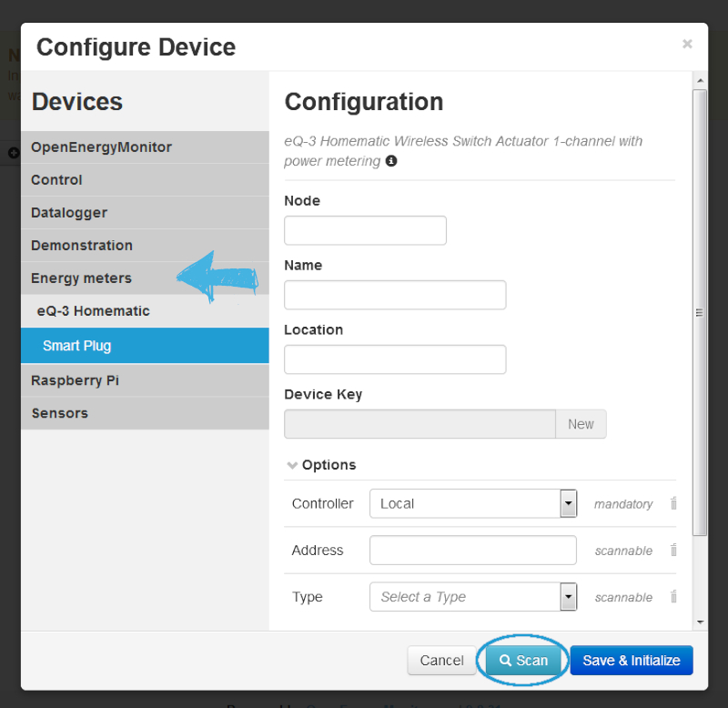
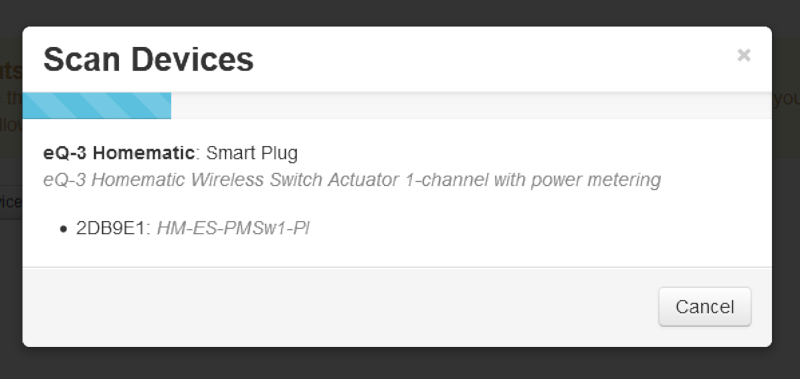
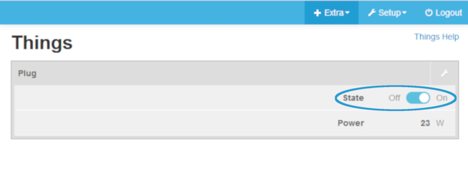

[HomeMatic by eQ-3](https://www.eq-3.de/produkte/homematic.html) is a Smart Home System, operating on 868-MHz. At this relatively low frequency, highly stable transmissions over several 100m are possible with the signal being immune to disturbances from Wifi or similar radio signals.  

This project allow to read and control HomeMatic devices inside the [emonmuc](https://github.com/isc-konstanz/emonmuc/) (**e**nergy **mon**itoring **m**ulty **u**tility **c**ommunication) framework, allowing them to be controlled by other applications or energy management systems. To enable communication over 868-MHz, the installation of a radio transceiver is necessary.  
Recommended and tested hardware are e.g. CC1101 RF transceivers:

- [Stackable CC1101 (SCC) module for Raspberry Pi](http://busware.de/tiki-index.php?page=SCC)
- [CC1101 USB Lite (CUL) module](http://busware.de/tiki-index.php?page=CUL)

With the emonmuc framework installed, the driver should be enabled with

~~~
emonmuc install homematic-cc1101
~~~

----------

# HomeMatic Smart Plug

As a commonly used device in a Smart Home, the HomeMatic Smart Plug will be used here as an example. It allows switching of connected loads and measures the voltage, current, frequency and power consumption. This guide will give a short introduction into how to connect, install and use the plug.  
The Smart Plug used is a [Wireless Switch Actuator 1-channel with power metering](https://www.eq-3.de/produkte/homematic/schalten-und-messen/homematic-funk-schaltaktor-1-fach-mit-leistungsmessung-typ-f.html) from HomeMatic.

The Smart Plug has only one button, with which it e.g. can be turned on/off or paired, depending on how long the button is getting pressed. Below the button there is a LED, indicating some information on the current status of the plug. With the most important LED status being:

- **Off**: Switched off and connected appliances will be turned off
- **Constant Red or Green**: Switched on, indicating power consumption of connected appliances
- **Slow, then fast yellow flashing:** Pairing enabled and in process
- **1s lightning up Green:** Pairing successful
- **2s lightning up Red:** Pairing failed

## Pairing

The Smart Plug needs to be paired first, before using it in the emonmuc framework. To enable the pairing of the device, proceed as follows:  
Make sure to plug it into a socket first, open and log in to your local [emoncms](https://emoncms.org/) platform. Go to **Setup > Inputs** and add a **new Device**.

Configure your eQ-3 EnergyMeter device: **Energy meters > eQ-3 HomeMatic > Smart Plug** and press the **Scan** button to start the pairing process.

The pairing process will continue for 60 seconds, allowing to go to the HomeMatic device and press its button. Hold the button for at least four seconds. The LED should start flashing slowly (one time per second) yellow. That means, that the teach-in procedure is in progress. After returning back to the emoncms site, it should show something like this:

Select the device. After saving and initializing it, the Smart Plug was successfully paired and configured into the emonmuc framework.  
This process correlates to all available HomeMatic device types and can be used as a reference accordingly.

## Control

To switch the Smart Plug, open the *Things* view and turn the plug on/off as you like. Additionally, the listed thing shows the current power of the plug, in this case 23W.

The *Feeds* view shows all the parameters the plug can measure, and allows the exploration of historically measured data.
