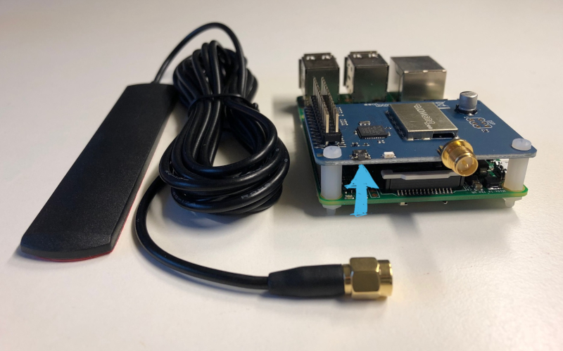

This document describes how to prepare and flash the [SCC (**S**tackable **CC**1101) RF transceiver module](http://busware.de/tiki-index.php?page=SCC) by busware, to enable the HomeMatic communication for the [emonmuc](https://github.com/isc-konstanz/emonmuc/) (**e**nergy **mon**itoring **m**ulty **u**tility **c**ommunication) platform on a Raspberry Pi.

---------------

# 1 Install prerequisites

The flashing of the SCC module can be done comfortably on the Raspberry ought to use. To do so, simply prepare the Raspberry to install the firmware via the UART Pins that will also be used during operation.  
First, mount the board on the Raspberry Pi and place it in your reach, as a button on the board will be necessary to be pressed during the installation process.

## 1.1 Prepare the Serial Port

**The SCC occupies UART RX/TX- and the GPIO17/18-Pins** and communicates over the serial port `ttyAMA0`. The emonmuc framework handles this communication using the open-source project [jRxTx](https://github.com/openmuc/jrxtx). This, as well as some additional steps to use the UART Pins of the Raspberry Pi Platform need to be prepared.
The [Serial Port preparation guide](LinuxSerialPort.md) may be followed to do so.

## 1.2 Install AVR Downloader/UploaDEr

[AVRDUDE](http://www.nongnu.org/avrdude/) is a utility to download/upload/manipulate the ROM and EEPROM contents of AVR microcontrollers and is necessary to flash the modules firmware.

To install, download the binaries via debian repository:

~~~
sudo apt-get install avrdude gcc-avr binutils-avr avr-libc
~~~

# 2 Flashing the Firmware

The official firmware may be downloaded from [http://culfw.de/](http://culfw.de/culfw.html) with its current Version: (as of 2017-09-07) [1.67](http://culfw.de/culfw-1.67.tar.gz).  
Change the directory to the released SCC makefile afterwards.

~~~
cd ~
wget http://culfw.de/culfw-1.67.tar.gz
tar -zxf culfw-1.67.tar.gz
cd culfw-1.67/Devices/SCC
~~~

Now, take a look at the front-side of the board, next to its antenna.  
**Before** and **during** the flashing, the program-button needs to be pressed, located here:

While pressing the button, issue the `program` build command to complete the preparation of the SCC module.  

~~~
sudo make program
~~~

If the update fails (which is quite possible), `sudo reboot` the system if not done so already and execute the flashing process manually and without safemode. Remember to keep the program button pressed while starting.

~~~
cd ~/culfw-1.67/Devices/SCC
if test ! -d /sys/class/gpio/gpio17; then sudo echo 17 > /sys/class/gpio/export; fi
if test ! -d /sys/class/gpio/gpio18; then sudo echo 18 > /sys/class/gpio/export; fi
sudo echo out > /sys/class/gpio/gpio17/direction
sudo echo out > /sys/class/gpio/gpio18/direction
sudo echo 0 > /sys/class/gpio/gpio18/value
sudo echo 0 > /sys/class/gpio/gpio17/value && sleep 1
sudo echo 1 > /sys/class/gpio/gpio17/value && sleep 1
sudo echo 1 > /sys/class/gpio/gpio18/value
sudo avrdude -u -p atmega1284p -P /dev/ttyAMA0 -c avr109 -b 38400 -U flash:w:SCC.hex
~~~

# 3 Finish

To finish the whole process, make sure to unexport the used GPIO Pins

~~~
if test -d /sys/class/gpio/gpio17; then sudo echo 17 > /sys/class/gpio/unexport; fi
if test -d /sys/class/gpio/gpio17; then sudo echo 18 > /sys/class/gpio/unexport; fi
~~~

At last, don't forget to remove the released tarball, to avoid cluttering of your system

~~~
cd ~
rm -r culfw*
~~~

If avrdude won't be needed anymore, it can be removed as well by issuing

~~~
sudo apt-get remove avrdude gcc-avr binutils-avr avr-libc && sudo apt-get autoremove
~~~

